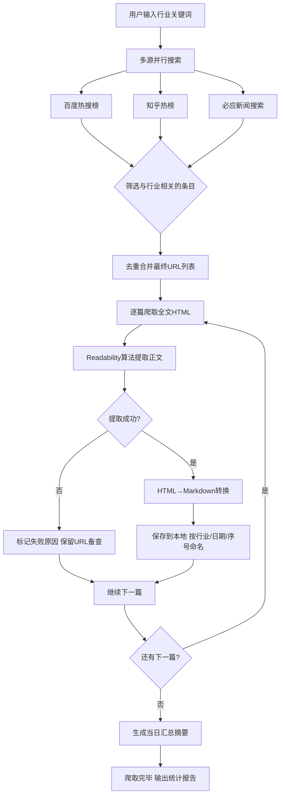

# 行业热点爬取工具 — 产品需求文档

> 版本：v1.0
> 日期：2026-06-23
> 状态：已确认

---

## 一、产品概述

### 一句话定位
> 这是一个给**自媒体内容创作者（个人）** 用的**本地 Python 命令行工具**，帮他们**输入一个行业关键词，自动搜索热点新闻、爬取全文、转成 Markdown 存到本地**。
> 与手动搜索+复制粘贴的方式相比，核心差异是**把「搜热点→看内容→存资料」这条链路自动化，每天省下 1-2 小时**。

### 产品形态
- **当前选型**：本地 Python CLI 工具
- **选择理由**：个人自用，不需要 UI、不需要上线部署、不需要多用户——Python 脚本最轻量，开发最快，爬取效率最高
- **阶段策略**：先做 CLI 版本跑通，后续可按需增加 Web 界面或定时任务

### 目标用户
- **核心用户**：你自己——每天需要产出 3-4 篇自媒体内容来推广产品，需持续跟踪行业热点作为素材
- **核心痛点**：每天手动搜热点、打开文章、复制保存，重复劳动占用大量时间
- **使用动机**：输入一个关键词跑一下脚本，热点文章已整理好在本地，直接在上面改

### 产品价值
- **用户价值**：素材搜集从每天 1 小时压缩到 5 分钟，且不会漏掉热点
- **商业价值**：间接价值——更高效地产出内容 → 更多曝光 → 更多产品转化

### 核心功能方向
- 输入行业关键词，自动从多个来源检索热点
- 自动爬取热门文章的完整正文内容
- 将 HTML 正文转换为 Markdown，保存在本地当前文件夹
- 按行业/日期归类存储，方便后续查找

### 不做什么
- ❌ 不做自动撰写/改写——只爬取保存，创作部分留给你
- ❌ 不做多用户/分享功能——纯本地工具
- ❌ 不做图片下载——仅保留原文图片链接
- ❌ 初期不做定时任务——手动触发，后续有需要再加

---

## 二、目标用户与使用场景

### 用户画像
- 个人创作者/创业者，有自己的产品需要推广
- 每天产出 3-4 篇行业相关内容运营公众号等自媒体
- 能运行 Python 脚本，但不一定深入编程

### 典型使用场景

**场景 1：每日选题**
> 每天早上在命令行输入 `python crawler.py 健康`，回来本地已自动生成当天健康行业的 5-10 篇热门文章 Markdown。直接打开文件夹浏览，挑 3 篇作为今日创作素材。

**场景 2：跨行业关注**
> 产品横跨「健康」和「科技」两个领域，分别跑 `python crawler.py 健康` 和 `python crawler.py 科技`，两个行业的素材自动归到不同文件夹。

**场景 3：快速回溯**
> 回顾上周某篇爬过的文章，打开 `健康/2026-06-16/` 按日期找到文件即可。

---

## 三、核心用户动线



---

## 四、功能清单

```
行业热点爬取工具
├── 🔴 模块A：多源热点搜索（核心，MVP必须有）
│   ├── 功能1：百度热搜爬取 + 关键词过滤
│   ├── 功能2：知乎热榜爬取 + 关键词过滤
│   └── 功能3：必应新闻搜索 + 结果提取
├── 🔴 模块B：文章正文爬取（核心，MVP必须有）
│   ├── 功能4：HTML全文获取
│   ├── 功能5：Readability正文提取
│   └── 功能6：反爬策略（UA轮换/请求延迟）
├── 🔴 模块C：Markdown转换与存储（核心，MVP必须有）
│   ├── 功能7：HTML→Markdown转换
│   ├── 功能8：按行业/日期归类存储
│   └── 功能9：汇总摘要生成
├── 🟡 模块D：交互与体验（重要）
│   ├── 功能10：命令行进度展示
│   ├── 功能11：失败重试机制
│   └── 功能12：输出统计报告
└── ⚪ 模块E：自动化增强（未来规划）
    ├── 功能13：定时任务支持
    └── 功能14：简单Web界面
```

---

## 五、关键交互流程（CLI 终端输出）

```
D:\> python crawler.py 健康

  ╔══════════════════════════════════════════════════════════╗
  ║   行业热点爬取工具 v1.0                                  ║
  ╚══════════════════════════════════════════════════════════╝

  ┌─ 正在搜索: 「健康」 ──────────────────────────────────┐
  │  [百度热搜] 获取中...  → 发现 8 条相关热点          ✓  │
  │  [知乎热榜] 获取中...  → 发现 5 条相关热点          ✓  │
  │  [必应新闻] 获取中...  → 发现 12 条相关新闻         ✓  │
  │  去重合并后: 共 18 篇待爬取                          │
  └──────────────────────────────────────────────────────┘

  ┌─ 正在爬取文章正文 ──────────────────────────────────┐
  │  [1/18] 国家卫健委发布健康中国行动新政               │
  │         → ✓ 已保存 (2.3s)                           │
  │  [2/18] 2026年夏季养生趋势全解读                     │
  │         → ✓ 已保存 (1.8s)                           │
  │  [3/18] 人工智能赋能医疗健康领域                     │
  │         → ✗ 提取失败 (页面结构异常) → 已跳过        │
  │  ...                                               │
  └──────────────────────────────────────────────────────┘

  ╔══════════════════════════════════════════════════════════╗
  ║  爬取完毕!                                              ║
  ║  成功: 15 篇  |  失败: 3 篇  |  总计: 18 篇            ║
  ║  保存路径: ./健康/2026-06-23/                           ║
  ║  用时: 42.3 秒                                          ║
  ╚══════════════════════════════════════════════════════════╝
```

### 输出目录结构

```
{当前目录}/
└── {行业关键词}/
    └── {YYYY-MM-DD}/
        ├── 001_{文章标题}.md
        ├── 002_{文章标题}.md
        ├── ...
        └── _summary.md    ← 汇总文件
```

---

## 六、功能详细描述

### 6.1 百度热搜爬取 + 关键词过滤

| 项目 | 内容 |
|------|------|
| **功能描述** | 爬取百度热搜榜单，筛选与行业关键词相关的内容 |
| **触发条件** | 用户运行脚本后自动触发 |
| **技术实现** | requests + BeautifulSoup 解析热搜页面，关键词模糊匹配标题 |
| **空结果** | 输出 `[百度热搜] 未发现相关热点`，继续下一来源 |
| **失败处理** | 网络/反爬失败 → 输出原因，继续下一来源 |
| **上限控制** | 匹配超过 30 条时取热度最高的前 15 条 |
| **超时设置** | 10s 超时，超时后跳过 |

### 6.2 知乎热榜爬取 + 关键词过滤

| 项目 | 内容 |
|------|------|
| **功能描述** | 爬取知乎热榜，从热门问题中筛选相关讨论 |
| **技术实现** | 问题标题 + 话题标签双重匹配 |
| **反爬策略** | 合理 UA + 请求间隔 ≥2s |

### 6.3 必应新闻搜索

| 项目 | 内容 |
|------|------|
| **功能描述** | 用行业关键词在必应新闻中搜索，获取最新新闻结果 |
| **技术实现** | 请求 `https://www.bing.com/news/search?q=关键词`，解析标题/URL/摘要/来源/时间 |
| **上限控制** | 取前 15 条 |

### 6.4 HTML 全文获取

- **请求库**：requests，预置 10+ 常见 User-Agent 轮换
- **请求间隔**：1-3s 随机延迟
- **编码处理**：自动检测

**状态矩阵：**

| 状态 | 触发条件 | 输出 |
|------|---------|------|
| 等待 | 在队列中 | 灰色显示序号和标题 |
| 爬取中 | 正在请求 | 显示 `正在获取...` |
| 成功 | HTTP 200 + 有内容 | `✓ 已保存 (耗时)` |
| 失败-网络 | 超时/连接拒绝 | `✗ 网络错误 (原因)` |
| 失败-反爬 | 403/429 | `✗ 被拦截，已跳过` |
| 失败-空内容 | 200 但正文为空 | `✗ 内容为空，已跳过` |

### 6.5 Readability 正文提取

- 主方案：`python-readability`（Mozilla Readability Python 移植）
- 降级方案：提取失败时用 BeautifulSoup 取文本最多的区域
- 提取字段：文章标题、正文 HTML、作者、发布时间

### 6.6 HTML → Markdown 转换

- 转换库：`html2text`
- 图片处理：保留 `` 格式，**不下载图片到本地**

转换规则：

| HTML 元素 | Markdown 输出 |
|-----------|-------------|
| `h1` ~ `h6` | `#` ~ `######` |
| `<p>` | 普通文本 |
| `` | `` |
| `<a>` | `[文字](URL)` |
| 列表 | `-` / `1.` |
| `blockquote` | `>` 引用 |
| 表格 | Markdown 表格 |

### 6.7 文件存储

- 文件名：`{3位序号}_{标题前20字}.md`
- 非法字符：自动移除 `\/:*?"<>|`
- 汇总文件 `_summary.md` 包含当日所有文章的标题/来源/状态汇总

### 6.8 命令行接口

```
python crawler.py <行业关键词> [可选参数]

可选参数：
  --max N       每源最多取 N 条（默认：15）
  --delay N     请求间隔秒数（默认：2）
  --skip-search 跳过搜索，直接爬取（用于重试失败文章）
```

---

## 七、数据规范

### 7.1 文章元数据（Front-matter）

```yaml
---
title: "国家卫健委发布健康中国行动新政"
url: "https://www.example.com/article/123"
source: "百度热搜"
date: "2026-06-23"
author: "人民日报"
keyword: "健康"
crawl_time: "2026-06-23 09:15:32"
summary: "国家卫健委今日发布..."
status: "success"
---
```

### 7.2 配置文件（config.json）

```json
{
  "max_per_source": 15,
  "request_delay": 2,
  "user_agents": [
    "Mozilla/5.0 (Windows NT 10.0; Win64; x64) ..."
  ],
  "sources": {
    "baidu": true,
    "zhihu": true,
    "bing": true
  }
}
```

---

## 八、技术选型

| 依赖 | 用途 |
|------|------|
| Python 3.9+ | 运行环境 |
| `requests` | HTTP 请求 |
| `beautifulsoup4` | HTML 解析 |
| `python-readability` | 正文提取（Mozilla Readability） |
| `html2text` | HTML → Markdown 转换 |
| `fake-useragent` | User-Agent 轮换 |
| `rich` | 终端美化（进度条/颜色） |

---

## 九、非功能性需求

- **性能**：单次搜索+爬取 15 篇文章，总耗时 **< 3 分钟**
- **健壮性**：单篇失败不影响整体流程，失败原因可追溯
- **兼容性**：Windows 10/11，Python 3.9+
- **安全**：纯本地运行，不上传任何数据
- **存储**：单篇 Markdown 约 20-100KB，日均 20 篇约 2MB

---

## 十、待确认问题（已确认）

- [x] **信息源**：百度热搜 + 知乎热榜 + 必应新闻搜索 — **已确认，后续可换**
- [x] **输出位置**：当前文件夹下 — **已确认**
- [x] **图片处理**：不下载图片，仅保留链接 — **已确认**
- [ ] **待后续实际使用再调整的问题**：来源增删、每日频次、是否加定时任务
